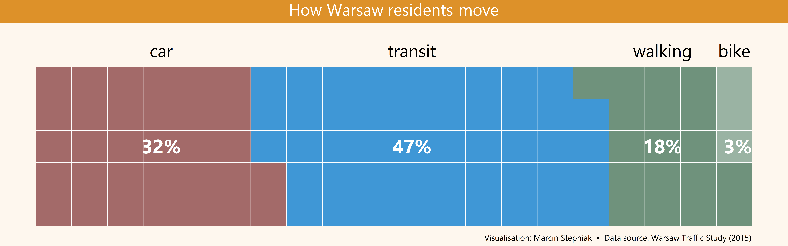
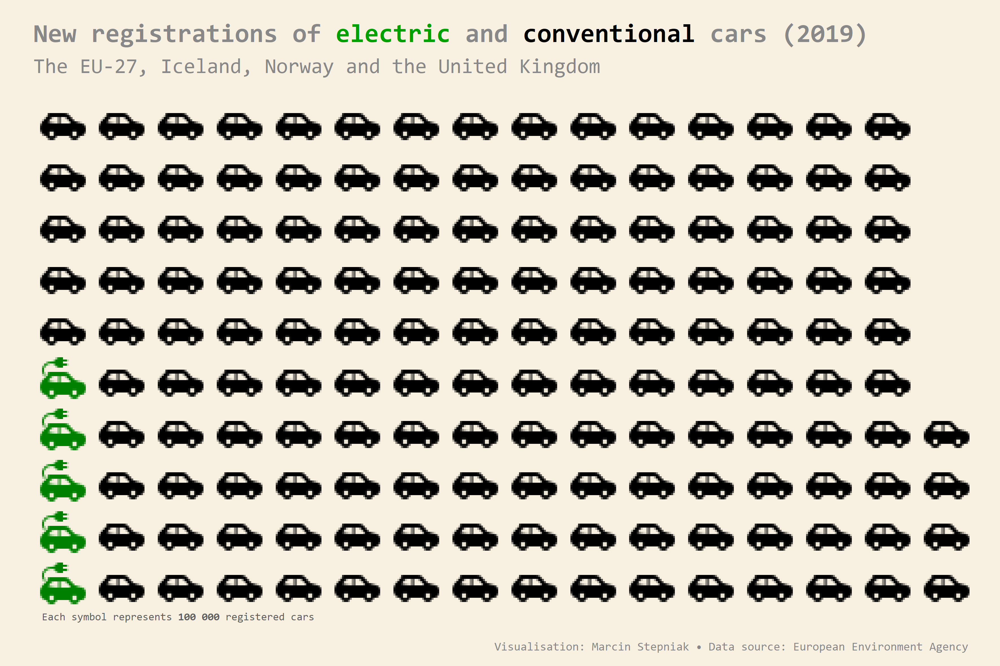

# 30DayChartChallenge

Repository for #30DayChartChallenge 2021

## Day 1: Part-to-whole

## Day 2: Pictogram

## Day 3: Historical

## Day 4: Magical

## Day 5: Slope

## R code

+ [Day 1](https://github.com/stmarcin/30DayChartChallenge/blob/main/R/day_01.R)
+ [Day 2](https://github.com/stmarcin/30DayChartChallenge/blob/main/R/day_02.R)
+ [Day 3](https://github.com/stmarcin/30DayChartChallenge/blob/main/R/day_03.R)
+ [Day 4](https://github.com/stmarcin/30DayChartChallenge/blob/main/R/day_04.R)
+ [Day 5](https://github.com/stmarcin/30DayChartChallenge/blob/main/R/day_05.R)